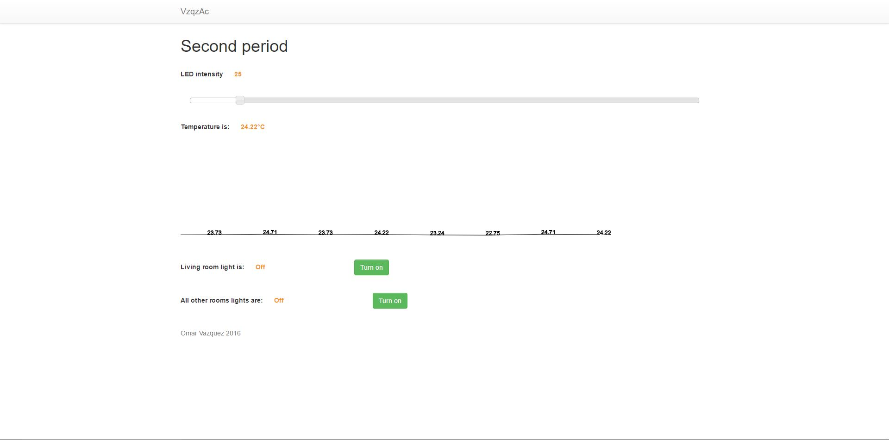

To check it out you need to have an arduino (UNO used during development) whit the following pins attached to: 

| PIN 	  | COMPONENT 				   |
|---------|----------------------------|
|4	  	  |push_button (other rooms)   |
|6	  	  |LED (dimmable LED)		   |
|7	  	  |push_button (living room)   |
|8	  	  |push_button (backyard)	   |
|9	  	  |relay (backyard bulb)	   |
|11	  	  |transistor (for a fan)      |
|12	  	  |LED (other rooms)		   |
|13   	  |LED (living room)		   |
|A0	 	  |photoresistor (living room) |
|A1  	  |TMP36 (can be changed) 	   |
|A2 and A5|IR sensors (people counter) |
|5v		  |IR light emitter			   |

And then...

```
git clone https://github.com/VzqzAc/Embedded-systems.git
cd Embedded-systems/embedded-systems-round-2
npm install
node server
```
And go to your http://localhost:3000 (you can change the port on the server.js file), there, you should see something like this:



**Ps. You need to add bootstrap, jquery, p5.js to `assets/lib` and `assets/styles` folders**

# What?
Home automation with the following characteristics

1. It has 3 rooms, one living room, dining room, kitchen, bathroom, and a backyard
2. The living room light must be activated both manually or automatic with the use of a photoresistor
3. Every other rooms lights are controlled manually with a button
4. It has a ventilation system using tmp36 and a dc motor
5. Backyard's light is controlled manually with a pushbutton and is an AC bulb
6. A dimmable light

# How?
Node.js, p5.js, johhny-five, jquery, bootstrap and socket.io are implemented to enhance user-arduino interaction via
web app with controls and a chart to show the current temperature

# Why?
Originally this was created to get a good grade at the University, but I'm thinking about using it in my own house, but first I need to improve it